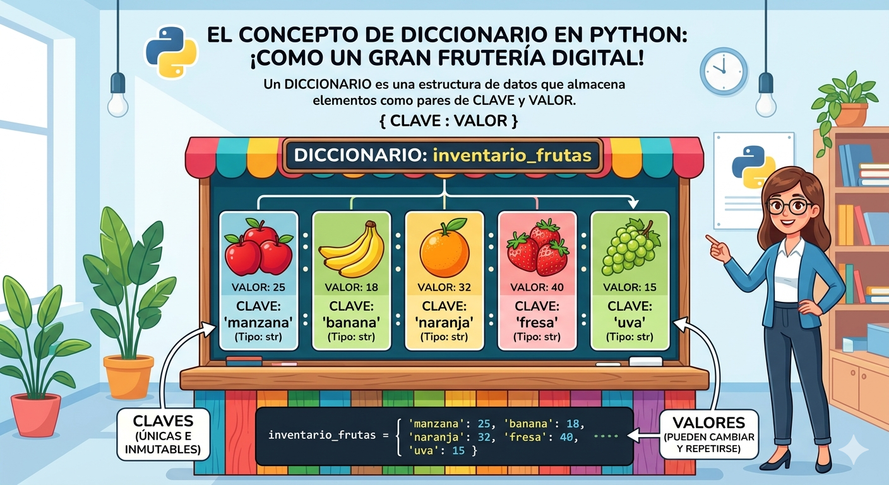

# DICCIONARIOS EN PYTHON 
Conceptos y ejercicios de diccionarios python

- Los diccionarios son datos estruccturados, es decir, hacen referencia a una coleccion de datos.
- Son una coleccion desordenada de pares de datos de la forma **clave:valor**, conocidos como elementos o items. 
- Son mutables, una vez definido se le pude agregar nuevos elementos modificar o eliminar algunos de los que ya tiene 
- tambien son cocnocidos como arreglos asociativos 

## representacion grafica de un diccionario



## sintaxis 

`nombre_diccionario = {clave:valor1, clave2,: valoe2,...}`

- Cada item o item tiene la forma **clave:valor**
- En cada hay una clave y uno o mas valores. Si se desconoce el valor, se puede completar con *None*
- Los elementos del diccionario se indexan por la clave.
- Las claves solo pueden ser datos inmutables 
- Los valores solo pueden ser datos mutables o inmutables 
- Las cavles no pueden repetirse dentro de un diccionario 

### ejemplo 

`frutas = {"manzana":}`

## operaciones 

### Agregar elementos 

`nombre_diccionario[clave] = valor`

`frutas['cereza'] = 90 

### consultar o modificar elementos 

`print('El valor de pera es:', frutas ['pera'])`

## Eliminar elementos 

`del frutas ['pera']`

### operador de pertenencia 

```py
if 'cereza' in frutas: 
    print('si esta cereza en el diccionario')
else: 
    print('no esta cereza en el diccionario')
```
## Ejercicio 
Cree un programa en python que utilice un diccionario para guardar el nombre de sus amigos y sus telefonos. En este caso el diccionario reprecenta una agenda telefonica el programa te dira nombres y telefonos y los ira guardando en el diccionario (los nombres en mayuscula). Ademas, el programa debe permitir consultar o eliminar un telefono incluya un menu de ocupaciones 
